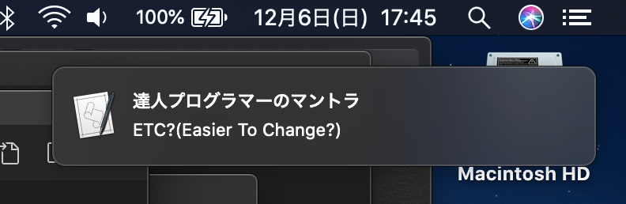

達人プログラマー第２版　 P.38 に、「ファイル保存時に、ETC?とメッセージを表示して、変更しやすいものになっているかを考えよう」というチャレンジがありました。

ETC とは Easier To Change で、変更しやすくなっているか？というマントラ的キーワードのようです。

これをいつも使ってる VSCode に仕込んでみます。

- ファイル保存時に何かを動かすには、[Run On Save プラグイン](https://marketplace.visualstudio.com/items?itemName=emeraldwalk.RunOnSave&ssr=false#overview)を使う
  - プラグインインストール後は、VSCode の再起動を忘れずに
- Run on save プラグインで echo すると、隠れた Run on Save タブの中で echo されるだけで目立たない
- なので Mac の通知欄に出すようにする

  - osascript というコマンドでできる
    - ↑ は Mac の標準で、AppleScript を実行できる
  - `osascript -e 'display notification "ETC?(Easier To Change?)" with title "達人プログラマーのマントラ"' `

- 以下を setting.json に追加

```
  "emeraldwalk.runonsave": {
    "commands": [{
      "match": ".*",
      "isAsync": true,
      "cmd": "osascript -e 'display notification \"ETC?(Easier To Change?)\" with title \"達人プログラマーのマントラ\" '"
    }]
  }
```

これで、VSCode でなにか保存したら、Mac の通知にピコピコとでてくるようになりました。

